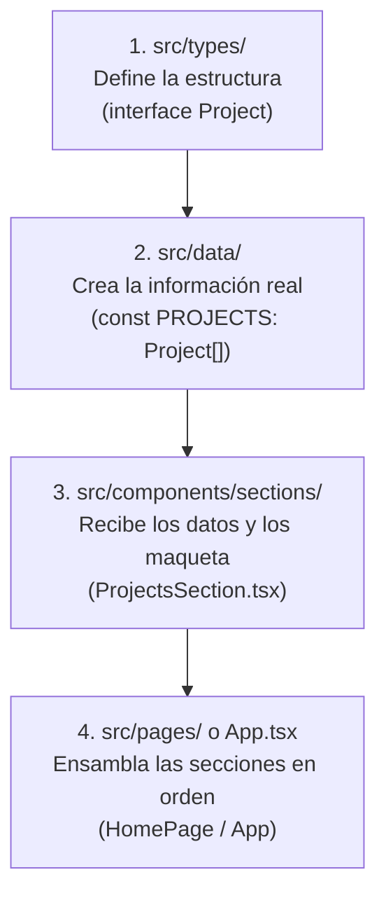

# 📘 Guía Maestra de Arquitectura Frontend con React + TypeScript
> **Autor:** Elvis Velásquez — *Guía de Estándares, Clean Code y Buenas Prácticas Frontend*

---

## 🎯 ¿Por qué usar una Arquitectura Modular y Ordenada?

Cuando empezamos en React, es muy común crear componentes gigantes donde mezclamos:
- Texto fijo (hardcodeado).
- Estilos de Tailwind desordenados.
- Tipos de TypeScript improvisados.
- Lógica de llamadas a API.

Esto se conoce como **"Código Espagueti"** o componentes monolíticos. Funciona al principio, pero cuando el proyecto crece se vuelve casi imposible de mantener, actualizar o corregir errores.

La **Arquitectura Modular (Clean Code)** se basa en un principio fundamental:
> **"Cada archivo debe tener una sola responsabilidad bien definida."**

---

## 🗺️ Mapa Completo de Carpetas y sus Responsabilidades

En tus proyectos de React + TypeScript, esta es la estructura estándar recomendada para mantener el código limpio y escalable:

```text
mi-proyecto/
├── public/                📁 Archivos estáticos públicos (imágenes, PDFs, logos, favicon)
│   ├── docs/              📄 Documentos para descarga (CV, certificados)
│   ├── img/               🖼️ Imágenes públicas y capturas de proyectos
│   │   ├── icons/         🧩 Iconos SVG de tecnologías
│   │   └── projects/      📸 Screenshots de aplicaciones
│   └── Logo.svg           ✨ Favicon y logos vectoriales
│
├── src/
│   ├── types/             📐 CONTRATOS (Reglas y formas de los datos)
│   ├── data/              📦 INFORMACIÓN PURA (Tu "base de datos" frontend)
│   ├── components/        🧩 COMPONENTES VISUALES
│   │   ├── ui/            🔹 Piezas básicas reutilizables (Botones, Badges, Tarjetas, Títulos)
│   │   ├── layout/        🔸 Estructuras fijas del sitio (Navbar, Footer, Sidebar)
│   │   └── sections/      🏛️ Bloques completos de la página (Hero, Proyectos, Contacto)
│   ├── pages/             📄 PANTALLAS (Página de Inicio, Dashboard, Detalle)
│   ├── hooks/             🪝 LÓGICA PERSONALIZADA (useScroll, useFetch, useTheme)
│   ├── assets/            🎨 RECURSOS INTERNOS procesados por Vite (imágenes importadas)
│   ├── App.tsx            🚀 Componente Raíz de la Aplicación
│   ├── main.tsx           ⚡ Punto de Entrada que monta React en el HTML
│   └── index.css          🎨 Estilos Globales y tokens de Tailwind CSS
│
├── index.html             🌐 El documento HTML único donde vive tu SPA
├── package.json           📦 Lista de librerías y comandos (npm run dev, build)
├── tsconfig.json          ⚙️ Configuración del compilador de TypeScript
└── vite.config.ts         ⚡ Configuración del empaquetador Vite
```

---

## 🔄 El Ciclo de Vida de los Datos: ¿Cómo se conectan los archivos?

El flujo de información en esta arquitectura sigue siempre 4 pasos ordenados:



### 1️⃣ Paso 1: `src/types/` (Las Reglas del Juego)
Aquí solo creas **Interfaces** y **Tipos**. No pones datos reales ni código HTML.
- **Ejemplo:** Defines qué campos debe tener un proyecto:
```typescript
// src/types/project.types.ts
export interface Project {
  id: string;
  title: string;
  description: string;
  tags: string[];
  demoUrl?: string; // El signo '?' significa que es OPCIONAL
}
```

### 2️⃣ Paso 2: `src/data/` (La Información Pura)
Aquí creas los arrays y objetos con tus textos reales, aplicando la interfaz creada en el Paso 1:
```typescript
// src/data/projects.data.ts
import { Project } from '../types/project.types';

export const PROJECTS: Project[] = [
  {
    id: 'tareo',
    title: 'Tareo — Gestor de Tareas',
    description: 'Aplicación fullstack con React y Node.js...',
    tags: ['React', 'TypeScript', 'PostgreSQL'],
    demoUrl: 'https://tareoapp.netlify.app'
  }
];
```

### 3️⃣ Paso 3: `src/components/sections/` (El Maquetado y Diseño)
El componente importa los datos y usa un `.map()` para dibujar cada tarjeta en pantalla:
```tsx
// src/components/sections/ProjectsSection.tsx
import React from 'react';
import { PROJECTS } from '../../data/projects.data';

export const ProjectsSection: React.FC = () => {
  return (
    <section id="projects" className="py-24">
      {PROJECTS.map((proyecto) => (
        <div key={proyecto.id} className="p-6 bg-zinc-900 rounded-xl">
          <h3>{proyecto.title}</h3>
          <p>{proyecto.description}</p>
        </div>
      ))}
    </section>
  );
};
```

### 4️⃣ Paso 4: `src/pages/` o `App.tsx` (El Ensamblaje Final)
El archivo principal simplemente llama a las secciones de arriba hacia abajo:
```tsx
// src/App.tsx
import { Navbar } from './components/layout/Navbar';
import { HeroSection } from './components/sections/HeroSection';
import { ProjectsSection } from './components/sections/ProjectsSection';
import { Footer } from './components/layout/Footer';

export const App = () => {
  return (
    <div className="min-h-screen bg-[#09090b]">
      <Navbar />
      <main>
        <HeroSection />
        <ProjectsSection />
      </main>
      <Footer />
    </div>
  );
};
```

---

## 🏆 Las 5 Reglas de Oro de un Desarrollador Frontend

### Regla 1: Nunca escribas textos largos repetidos dentro del JSX
- Si tu correo o nombre se usa en más de un componente, ponlo en `src/data/personal.data.ts`.
- Si tienes una lista de habilidades o proyectos, ponla en un archivo `.data.ts`.

### Regla 2: Componentes Pequeños y Reutilizables en `src/components/ui/`
- Si tienes un botón especial o un título con degradado que vas a usar en 4 secciones, **conviértelo en un componente reutilizable en `ui/`** y pásale propiedades (`props`).
- Esto evita tener que copiar y pegar las mismas 15 clases de Tailwind una y otra vez.

### Regla 3: `public/` vs `src/assets/`
- **Usa `public/`** para archivos que se acceden por ruta directa (PDFs descargables, capturas de pantalla de proyectos, favicon).
- **Usa `src/assets/`** para imágenes locales críticas que quieras importar con `import Foto from './assets/foto.jpg'` para que Vite las optimice en el empaquetado.

### Regla 4: Nombres Claros y Explícitos
- En vez de nombrar variables como `d`, `temp`, `x`, usa nombres descriptivos como `proyecto`, `experienciaActual`, `estaCopiado`.
- Tu código debe poder leerse casi como un libro en español o inglés sin necesidad de adivinar qué contiene cada variable.

### Regla 5: Mantén `.gitignore` configurado desde el Día 1
- **NUNCA** subas `node_modules` ni `dist` a GitHub.
- Siempre ten tu archivo `.gitignore` con:
```gitignore
node_modules
dist
.env
```

---

## 📖 Glosario de Términos para el Desarrollador Junior

| Término | ¿Qué significa en lenguaje sencillo? |
| :--- | :--- |
| **Interface / Type** | La plantilla o molde que define qué datos obligatorios debe tener un objeto. |
| **Props (Propiedades)** | Parámetros que le envías a un componente hijo (como los argumentos de una función). |
| **State (`useState`)** | La memoria interna de un componente (ej: saber si el menú móvil está abierto o cerrado). |
| **Hook (`useEffect`)** | Una función especial de React para ejecutar lógica cuando algo cambia (ej: scroll de ventana). |
| **SPA (Single Page App)**| Aplicación web de una sola página que nunca recarga la pantalla por completo al navegar. |
| **Vite** | La herramienta ultrarrápida que compila, recarga y prepara tu código React para producción. |
| **Clean Code** | Código fácil de leer, fácil de entender y fácil de modificar por cualquier desarrollador. |

---

> 💡 **Consejo Profesional para tus Entrevistas:**  
> Cuando te pregunten sobre arquitectura en una entrevista técnica, menciona que aplicas **Separación de Responsabilidades (*Separation of Concerns*)**, aislando los **tipos de TypeScript**, la **capa de datos**, los **componentes de interfaz de usuario** y la **maquetación modular por secciones**. ¡Esto demuestra de inmediato mentalidad de desarrollador profesional!
